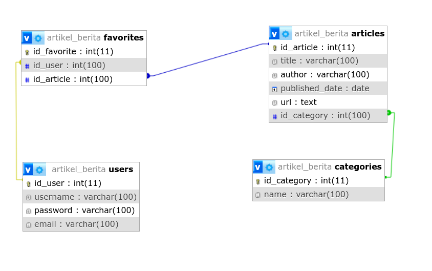

# NY Times REST API Report

    
    
    
    
    
    
    
    

## Table of Contents

1. [Introduction](#introduction)
2. [Database Design](#database-design)
3. [Endpoints Design](#endpoints-design)
4. [Backend API Documentation](#backend-api-documentation)
5. [Public API Integration](#public-api-integration)
6. [Middleware and Authorization](#middleware-and-authorization)
7. [Testing](#testing)
8. [Conclusion](#conclusion)

## Introduction

This report details the design and implementation of a REST API for accessing and managing articles, categories, favorites, and user data. The API integrates with the New York Times public API to fetch top stories and other article data. The backend is built using Node.js, Express, and MySQL, with JWT for authorization.

## Database Design

The database consists of four related tables:

1. **Users**

   - `id_user` (Primary Key)
   - `username`
   - `password`
   - `email`

2. **Categories**

   - `id_category` (Primary Key)
   - `name`

3. **Articles**

   - `id_article` (Primary Key)
   - `id_category` (Foreign Key)
   - `title`
   - `author`
   - `published_date`
   - `url`

4. **Favorites**
   - `id_favorite` (Primary Key)
   - `id_user` (Foreign Key)
   - `id_article` (Foreign Key)

        

## Endpoints Design

The API provides a total of **24 endpoints** for managing articles, categories, favorites, and user data, as well as fetching data from the [New York Times API](https://developer.nytimes.com/).

## Backend API Documentation

### Users

- **POST /api/users/register**

  - Parameters: `username`, `password`, `email`
  - Expected Result: `{ message: "User registered successfully" }`

- **POST /api/users/login**

  - Parameters: `username`, `password`, `email`
  - Expected Result: `{ token: "JWT_TOKEN" }`

- **GET /api/users/profile**

  - Headers: `Authorization: Bearer JWT_TOKEN`
  - Expected Result: `{ username, email }`

- **PUT /api/users/profile**

  - Headers: `Authorization: Bearer JWT_TOKEN`
  - Parameters: `username`, `password`, `email`
  - Expected Result: `{ message: "User updated successfully" }`

- **DELETE /api/users/profile**
  - Headers: `Authorization: Bearer JWT_TOKEN`
  - Expected Result: `{ message: "User deleted successfully" }`

### Articles

- **GET /api/articles**

  - Headers: `Authorization: Bearer JWT_TOKEN`
  - Expected Result: `[ { id_article, title, author, published_date, url, category } ]`

- **POST /api/articles**

  - Headers: `Authorization: Bearer JWT_TOKEN`
  - Parameters: `id_category`, `title`, `author`, `published_date`, `url`
  - Expected Result: `{ message: "Article added successfully" }`

- **PUT /api/articles/:id_article**

  - Headers: `Authorization: Bearer JWT_TOKEN`
  - Parameters: `title`, `author`, `published_date`, `url`, `id_category`
  - Expected Result: `{ message: "Article updated successfully" }`

- **DELETE /api/articles/:id_article**
  - Headers: `Authorization: Bearer JWT_TOKEN`
  - Expected Result: `{ message: "Article deleted successfully" }`

### Categories

- **GET /api/categories**

  - Headers: `Authorization: Bearer JWT_TOKEN`
  - Expected Result: `[ { id_category, name } ]`

- **POST /api/categories**

  - Headers: `Authorization: Bearer JWT_TOKEN`
  - Parameters: `name`
  - Expected Result: `{ message: "Category added successfully" }`

- **PUT /api/categories/:id_category**

  - Headers: `Authorization: Bearer JWT_TOKEN`
  - Parameters: `name`
  - Expected Result: `{ message: "Category updated successfully" }`

- **DELETE /api/categories/:id_category**
  - Headers: `Authorization: Bearer JWT_TOKEN`
  - Expected Result: `{ message: "Category deleted successfully" }`

### Favorites

- **GET /api/favorites**

  - Headers: `Authorization: Bearer JWT_TOKEN`
  - Expected Result: `[ { id_favorite, title, author, published_date, url, category } ]`

- **POST /api/favorites**

  - Headers: `Authorization: Bearer JWT_TOKEN`
  - Parameters: `id_article`
  - Expected Result: `{ message: "Added to favorites" }`

- **PUT /api/favorites/:id_favorite**

  - Headers: `Authorization: Bearer JWT_TOKEN`
  - Parameters: `id_article`
  - Expected Result: `{ message: "Favorite updated successfully" }`

- **DELETE /api/favorites/:id_favorite**
  - Headers: `Authorization: Bearer JWT_TOKEN`
  - Expected Result: `{ message: "Removed from favorites" }`

### NY Times

- **GET /api/nyt/top-stories**

  - Headers: `Authorization: Bearer JWT_TOKEN`
  - Expected Result: `{ results: [ ... ] }`

- **GET /api/nyt/search**

  - Headers: `Authorization: Bearer JWT_TOKEN`
  - Parameters: `query`
  - Expected Result: `{ results: [ ... ] }`

- **GET /api/nyt/search/date**

  - Headers: `Authorization: Bearer JWT_TOKEN`
  - Parameters: `query`, `begin_date`, `end_date`
  - Expected Result: `{ results: [ ... ] }`

- **GET /api/nyt/top-stories/:category**

  - Headers: `Authorization: Bearer JWT_TOKEN`
  - Parameters: `category`
  - Expected Result: `{ results: [ ... ] }`

- **GET /api/nyt/most-shared/:period**

  - Headers: `Authorization: Bearer JWT_TOKEN`
  - Parameters: `period`
  - Expected Result: `{ results: [ ... ] }`

- **GET /api/nyt/book-reviews**

  - Headers: `Authorization: Bearer JWT_TOKEN`
  - Parameters: `query`
  - Expected Result: `{ results: [ ... ] }`

- **GET /api/nyt/articles/section/:section**
  - Headers: `Authorization: Bearer JWT_TOKEN`
  - Parameters: `section`
  - Expected Result: `{ results: [ ... ] }`

You can see more details in the following documentation [here](https://documenter.getpostman.com/view/40838067/2sAYQanBYG)

## Testing

Each endpoint has been tested using Postman to ensure correct functionality and expected results.

1. 

## Public API Integration

The API integrates with the New York Times public API to fetch top stories, search articles, get most shared articles, and book reviews.

## Middleware and Authorization

The API uses several middleware functions for validation and authorization:

- **patternValidation**: Validates request body using Joi.
- **verifyLogin**: Verifies user credentials.
- **verifyToken**: Verifies JWT token.

## Conclusion

This report details the design and implementation of a REST API for managing articles, categories, favorites, and user data, with integration to the New York Times public API. The API uses middleware for validation and authorization, ensuring secure and reliable access to resources.
